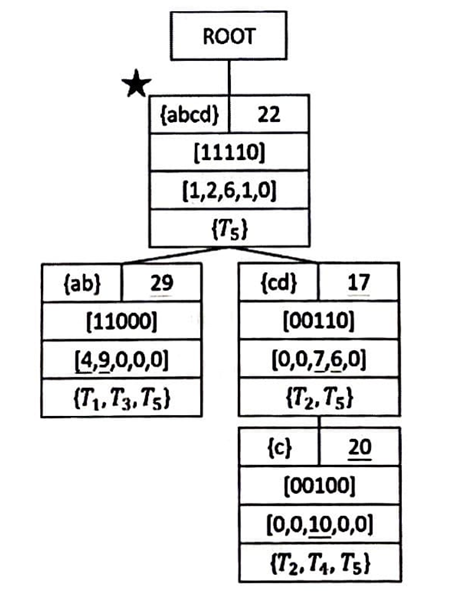
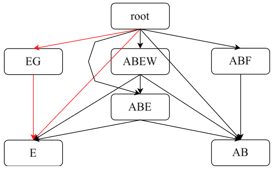
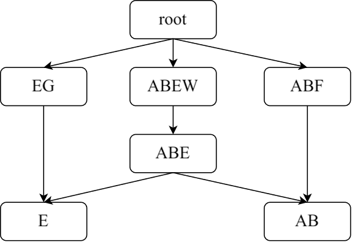
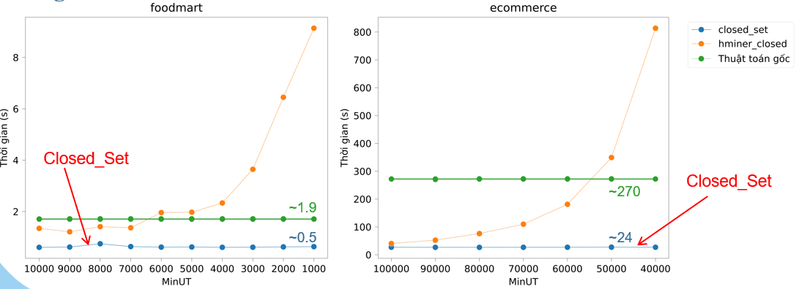

# ClosedSet_Lattice: Cải tiến thuật toán khai thác CHUI+

Năm 2023, Ye In Chang và cộng sự [[1]](https://www.ijfcc.org/show-106-1003-1.html) đã công bố thuật toán **ClosedSet_Lattice** để khai thác mẫu **CHUI+** trong cơ sở dữ liệu tăng trưởng.

  

Việc xây dựng cây dựa trên việc xác định mối quan hệ giữa các nút bằng các phép toán (operations) và được chia thành **5 trường hợp chính**:

## Cải tiến thuật toán

Repo này thực hiện **tối ưu cấu trúc dữ liệu** và **chiến lược thuật toán** nhằm giảm thời gian chạy (runtime) và mức sử dụng bộ nhớ (memory usage).

| Trước cải tiến | Sau cải tiến |
|---------------|-------------|
|  |  |

## Kết quả thực nghiệm

So sánh hiệu suất của thuật toán cải tiến với bài báo gốc trên hai bộ dữ liệu **foodmart** và **ecommerce**:

## Lưu ý

🚀 Repo **không** công khai bản cải tiến của thư viện **BitSet** và những phiên bản thư viện thay thế khác.

## Paper gốc

[1] Ye In Chang, Po Chun Chuang, Chun Yu Wang, and Yu Hao Liao, "An Efficient Approach for Mining Closed High Utility Patterns in the Incremental Database," *International Journal of Future Computer and Communication*, vol. 12, no. 4, pp. 84-92, 2023. 
    
